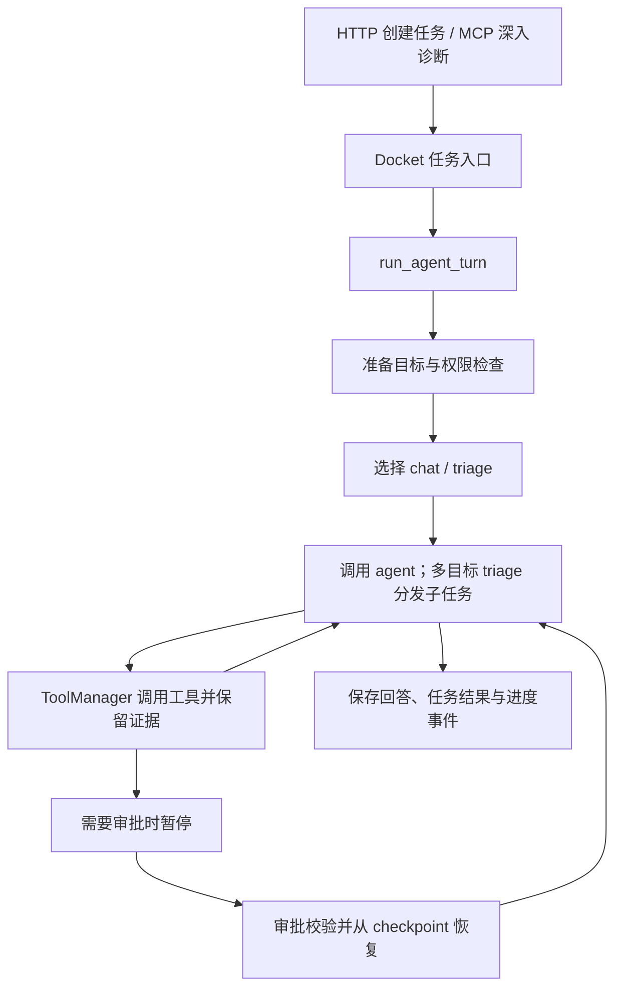

# Redis SRE Agent

这个项目通过大模型调用 Redis 诊断工具、检索知识库，并把回答、执行进度和工具证据保存到会话中。它提供 CLI、HTTP API 和 MCP 三类入口，支持普通问答、深入诊断、多目标诊断以及需要人工审批的操作。

第一次读代码，建议先看 [代码阅读指南](docs/code-reading-guide.md)，再从 [`run_agent_turn`](redis_sre_agent/core/turn_runner.py) 沿执行顺序读。无需先理解全部 provider、评测平台或部署配置。

## 一次后台请求怎么执行



CLI `query` 直接调用 agent；MCP 的普通问答/数据库问答仍使用兼容任务入口。它们与上述后台入口不是完全相同的执行路径，阅读指南列出了具体位置。

## 最少需要认识的目录

| 目录 | 职责 |
| --- | --- |
| `redis_sre_agent/agent/` | 模型与工具循环、chat 和深入诊断工作流 |
| `redis_sre_agent/core/` | 单轮执行、会话、任务、目标、审批和持久化 |
| `redis_sre_agent/tools/` | 工具注册、执行策略与各类 provider |
| `redis_sre_agent/targets/` | 目标类型、绑定与能力契约 |
| `redis_sre_agent/api/`、`cli/`、`mcp_server/` | 外部入口 |
| `redis_sre_agent/pipelines/`、`evaluation/` | 知识入库和评测 |
| `tests/`、`evals/` | 离线行为测试和评测场景/语料 |

## 本地验证

项目要求 Python 3.12 或更高版本，依赖声明见 [pyproject.toml](pyproject.toml)。使用 uv：

```sh
uv sync --group dev
uv run --group dev python -m pytest -q
uv run --group dev redis-sre-agent --help
```

已有虚拟环境时可直接用其中的 Python 执行 pytest；例如 Windows PowerShell：

```powershell
.\.venv\Scripts\python.exe -m pytest -q
```

`tests/` 的验证使用离线替身，不要求运行真实模型、Redis 或 MCP 服务；`evals/` 中的实时评测另有运行环境要求。

实际运行使用 [Settings](redis_sre_agent/core/config.py) 中的配置，包括服务自身的 Redis、模型接口、工具 provider 和可选集成。服务 Redis 与被诊断的 Redis 实例是不同角色。已有 `.env` 时沿用当前配置；启动真实 API、worker 或查询会连接配置的外部服务。

常用入口：

```sh
uv run redis-sre-agent query --help
uv run redis-sre-agent worker --help
uv run redis-sre-agent mcp --help
uv run uvicorn redis_sre_agent.api.app:app --host 127.0.0.1 --port 8000
```

API 的后台任务还需要 Docket worker 消费队列；具体启动选项见 `worker --help`。

## 本轮整理的边界

这次整理保留产品功能和外部入口，拆分后台执行主流程、归并重复保存逻辑、去掉已确认无引用的代码，并补充回归测试。详细范围见 [实施记录](docs/plans/2026-09-05-readability.md)。

仍有需要单独处理的行为问题：`ChatAgent` 的部分异常会被包装为含错误文字的正常响应，外层任务可能因此标为完成。本轮未改变这项错误语义；离线回归通过也不代表已验证所有真实服务故障场景。
